# 🛡️ Cybersecurity: Wazuh XDR & SIEM Deployment and Firewall Configuration

## 📖 Table of Contents
- [Introduction to Wazuh](#-introduction-to-wazuh-xdr--siem)
- [Project Overview](#-project-overview)
- [Objective](#-objective)
- [System Specifications](#️-system-specifications)
- [Deployment Methodology Workflow](#-deployment-methodology-workflow)
  - [Phase 1: Documentation & Requirements Verification](#phase-1-documentation--requirements-verification)
  - [Phase 2: Automated Installation](#phase-2-automated-installation)
  - [Phase 3: Service Validation](#phase-3-service-validation)
  - [Phase 4: Network Troubleshooting & Firewall Configuration](#phase-4-network-troubleshooting--firewall-configuration)
  - [Phase 5: Dashboard Initialization & Health Check](#phase-5-dashboard-initialization--health-check)
- [Security Relevance & Impact](#-security-relevance--impact)
- [Ethical Guidelines & Disclaimer](#️-ethical-guidelines--disclaimer)

---

## 🛑 Introduction to Wazuh (XDR & SIEM)
**Wazuh** is a free, open-source security platform that unifies Extended Detection and Response (XDR) and Security Information and Event Management (SIEM) capabilities. It protects endpoints and cloud workloads by providing log data analysis, intrusion detection, file integrity monitoring, and vulnerability detection. Deploying Wazuh allows security teams to centralize threat intelligence and actively monitor their infrastructure for malicious activity.

## 📌 Project Overview
This project documents the complete deployment of the Wazuh central components (Server, Indexer, and Dashboard) on a Linux environment. It details the process of executing the automated installation assistant, verifying backend services, and crucially, troubleshooting network connectivity issues by configuring the Uncomplicated Firewall (UFW) to permit secure web interface access.

## 🎯 Objective
To successfully provision a locally hosted Wazuh XDR platform, ensuring all core services are running correctly. A primary objective of this lab is to demonstrate practical Linux network troubleshooting by identifying firewall blocks and surgically opening the required listening ports to establish access to the SIEM dashboard.

## 🛠️ System Specifications
*   **Operating System:** Linux (Ubuntu/Debian architecture)
*   **Target Application:** Wazuh version 4.14
*   **Key Components:** Wazuh Manager, Wazuh Indexer, Wazuh Dashboard
*   **Networking Utilities:** `ufw` (Uncomplicated Firewall), `ss` (Socket Statistics), `ifconfig`

---

## 🚀 Deployment Methodology Workflow

### Phase 1: Documentation & Requirements Verification

The deployment began with researching the official Wazuh installation guidelines to ensure the correct architecture constraints were met.
 

Located the official Wazuh documentation to avoid third-party, potentially insecure installation guides.
 

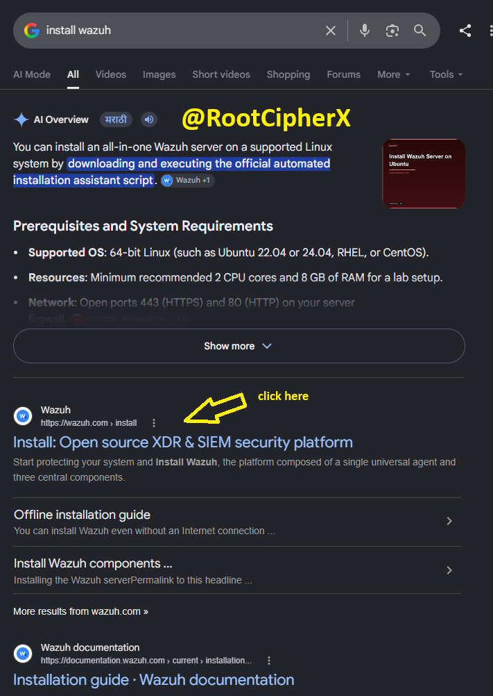

Navigated directly to the primary Documentation hub.
 

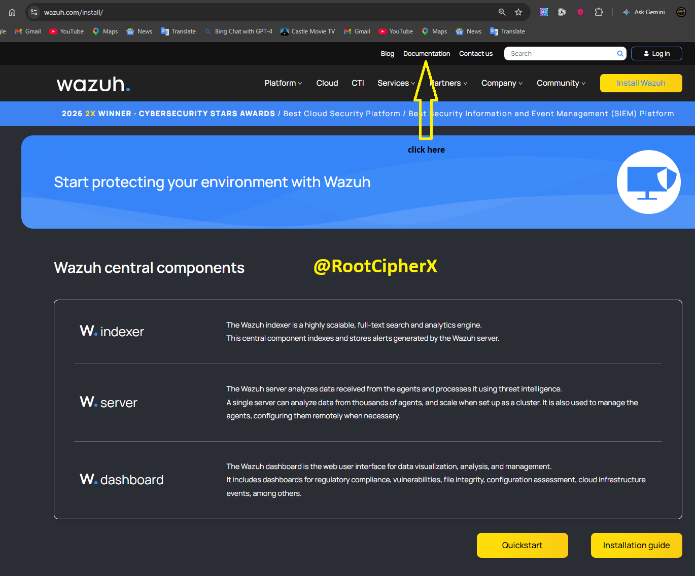

Selected the "Quickstart" guide, which provides the streamlined method for deploying all three central components on a single host.
 

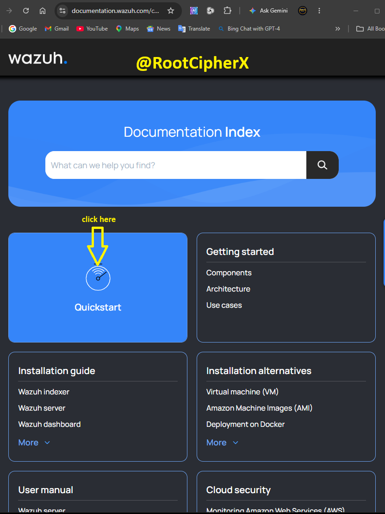

Reviewed the initial Quickstart deployment architecture and open-source licensing terms.
 

Verified the hardware prerequisites, ensuring the Virtual Machine was allocated a minimum of 4 vCPUs and 8 GiB of RAM to handle the heavy indexing workload.
 

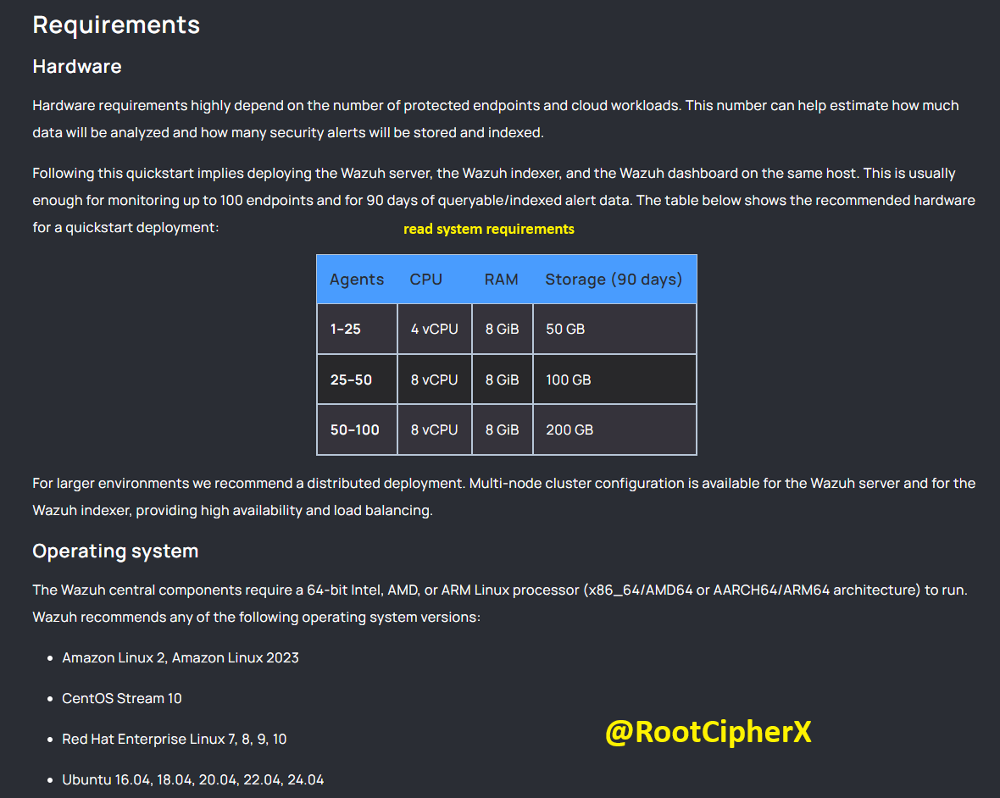

---

### Phase 2: Automated Installation

Acquired the official `curl` command to execute the Wazuh automated installation assistant.
 

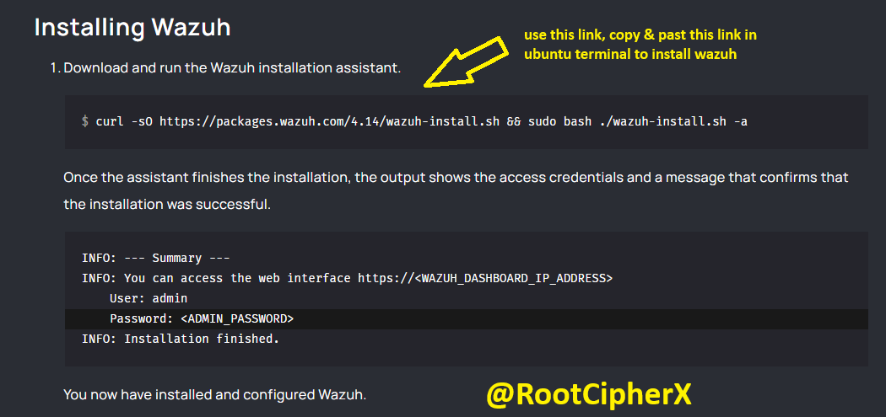

Executed the installation command in the Linux terminal. 
*   **Command Breakdown:** `curl -sO https://packages.wazuh.com/4.14/wazuh-install.sh && sudo bash ./wazuh-install.sh -a`
    *   `curl -sO`: Silently downloads the script file and saves it with its original remote name.
    *   `&&`: Ensures the second command only runs if the download is successful.
    *   `sudo bash ./wazuh-install.sh -a`: Executes the bash script with root privileges using the `-a` (assistant/automated) flag to handle dependencies and component linking automatically.
 

The installation completed successfully. The assistant automatically generated and output the highly secure `admin` credentials required for web dashboard access.
 

---

### Phase 3: Service Validation

Before attempting to access the dashboard, it is critical to verify that the underlying Linux services are running properly. I began by checking the primary manager.
*   **Command Breakdown:** `sudo systemctl status wazuh-manager` checks the current operational state of the manager daemon.
 

Verified the Wazuh Indexer, the core search and analytics engine that stores the alerts.
*   **Command Breakdown:** `sudo systemctl status wazuh-indexer`
 

Finally, verified the Wazuh Dashboard service, which powers the web-based user interface.
*   **Command Breakdown:** `sudo systemctl status wazuh-dashboard`
 

---

### Phase 4: Network Troubleshooting & Firewall Configuration

To access the dashboard from the host machine, the Virtual Machine's IP address was required.
*   **Command Breakdown:** `ifconfig` lists the current network interfaces, revealing the local IP as `192.168.139.129`.
 

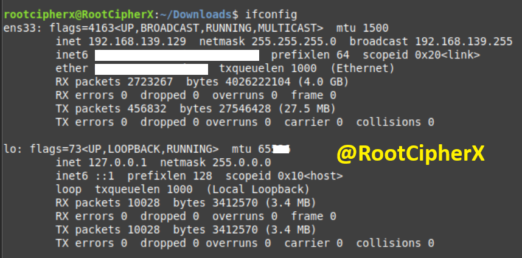

Attempted to browse to the IP address via HTTPS, but the connection timed out, indicating a network drop or firewall block.
 

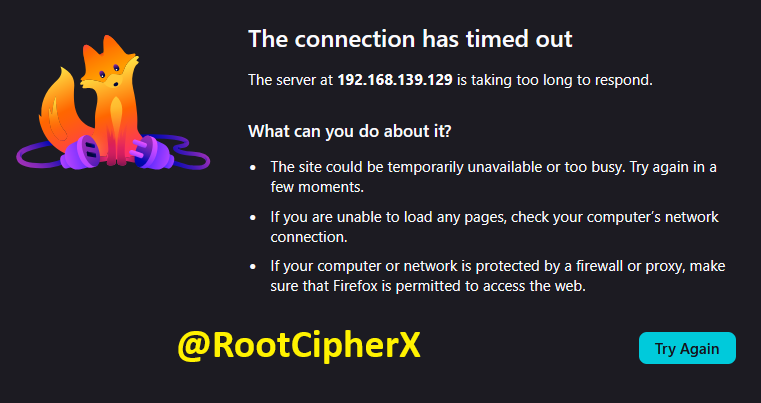

Initiated troubleshooting by checking the state of the Uncomplicated Firewall (UFW).
*   **Command Breakdown:** `sudo systemctl status ufw` revealed the firewall service was actively running.
 

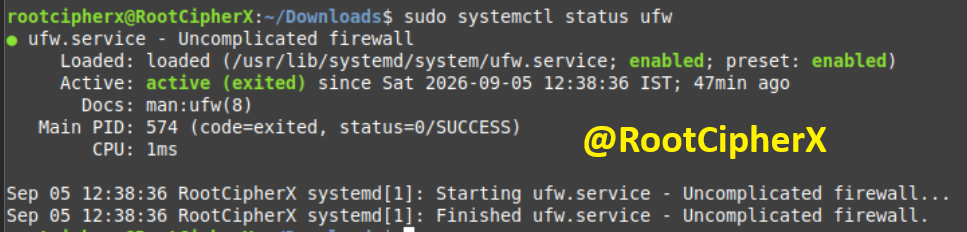

Queried the firewall's specific rule configuration.
*   **Command Breakdown:** `sudo ufw status verbose` showed that the default policy was set to `deny (incoming)`, meaning all web traffic to the dashboard was being blocked.
 

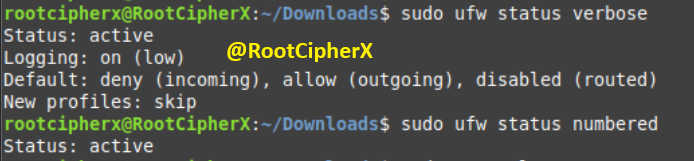

Verified which ports Wazuh was actively listening on to ensure the correct firewall rules would be applied.
*   **Command Breakdown:** `sudo ss -tuln` (Socket Statistics) displays all listening TCP (`-t`) and UDP (`-u`) ports numerically (`-n`). This confirmed active listeners on port 443 (HTTPS), 1514, and 1515.
 

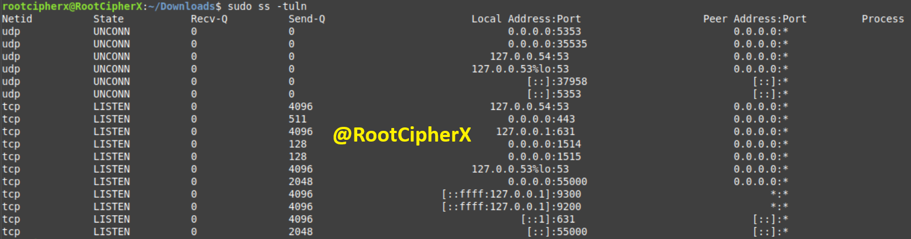

Surgically modified the firewall rules to permit inbound web traffic.
*   **Command Breakdown:** 
    *   `sudo ufw allow 80`: Opens port 80 for standard HTTP.
    *   `sudo ufw allow 443`: Opens port 443 for secure HTTPS dashboard access.
 

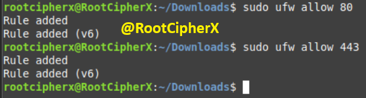

---

### Phase 5: Dashboard Initialization & Health Check

With the firewall properly configured, the browser successfully established an HTTPS connection, and the Wazuh platform began loading.
 

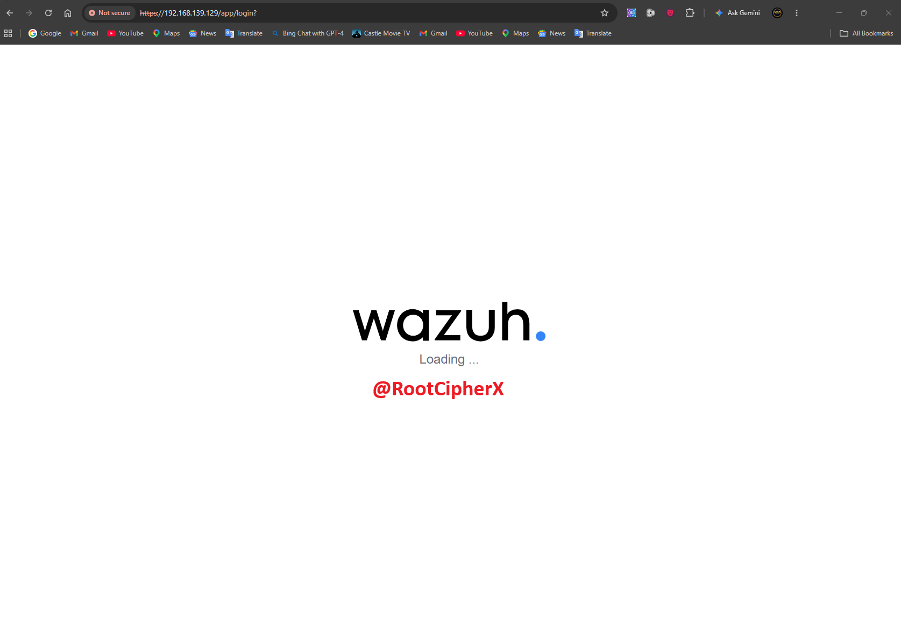

Successfully accessed the authentication portal and logged in using the generated `admin` credentials.
 

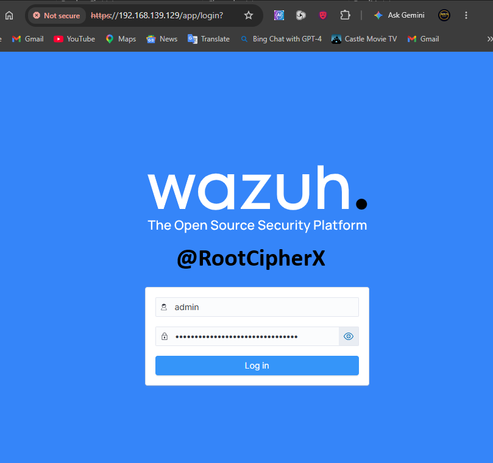

The system automatically initiated an API health check, successfully verifying the connection, versioning, and index patterns.
 

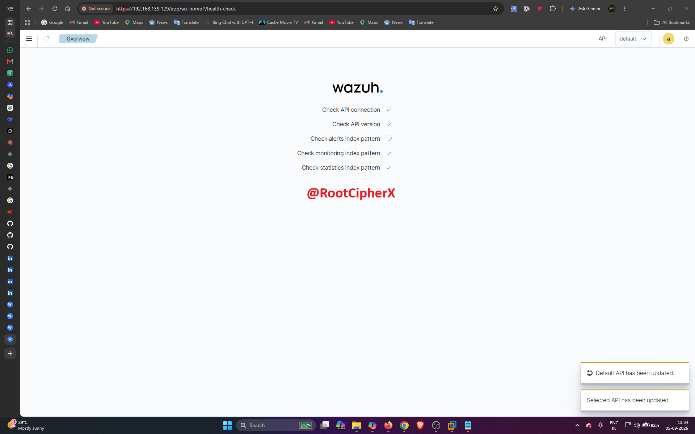

Reached the main Wazuh Dashboard, providing a comprehensive overview of security events, endpoint status, and threat intelligence metrics.
 

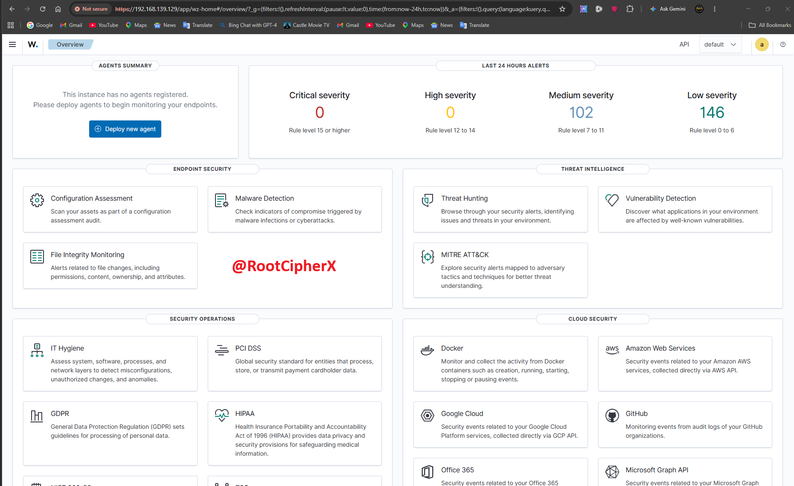

Navigated to the Discover tab (Wazuh Logs) to verify that raw system logs, rule descriptions, and indexing data were flowing correctly into the analytics engine.
 

---

## 🛡️ Security Relevance & Impact
Deploying an XDR/SIEM solution like Wazuh is critical for maintaining infrastructure visibility. However, deploying the software is only half the battle. The ability to utilize Linux command-line tools (`systemctl`, `ss`, `ufw`) to diagnose network timeouts, identify active listening sockets, and securely modify firewall rules demonstrates the practical systems engineering skills required to maintain an active Security Operations Center (SOC).

---

## ⚖️ Ethical Guidelines & Disclaimer
This deployment and network configuration lab was performed within a private, authorized Virtual Machine environment strictly for educational and defensive cybersecurity training purposes.
